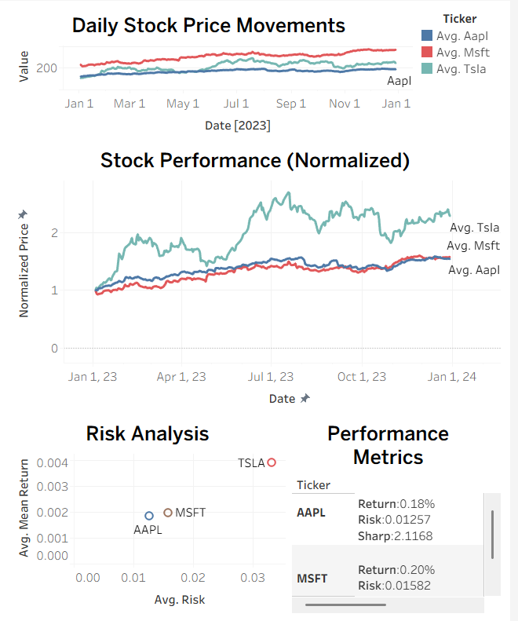

# Stock Analysis Dashboard (AAPL, TSLA, MSFT - 2023)

Stock analysis of AAPL, TSLA, and MSFT using Python and Tableau.

## What I Did
- Used stock data from Yahoo Finance via the yfinance library
- Extracted closing prices  
- Calculated daily returns, risk, and annual Sharpe ratio  
- Normalized stock prices for comparison  
- Built a Tableau dashboard to visualize the results  

## Dashboard

## Key Findings
- Tesla had higher returns but higher risk  
- Apple and Microsoft showed more stable performance  
